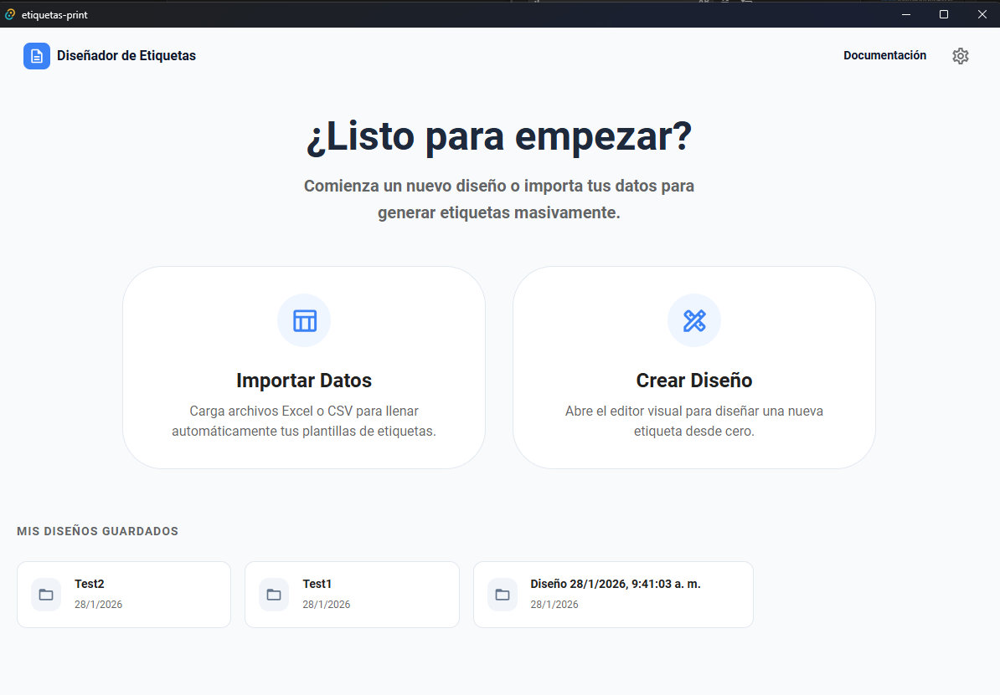
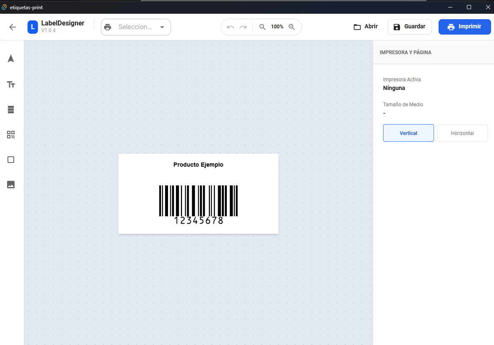
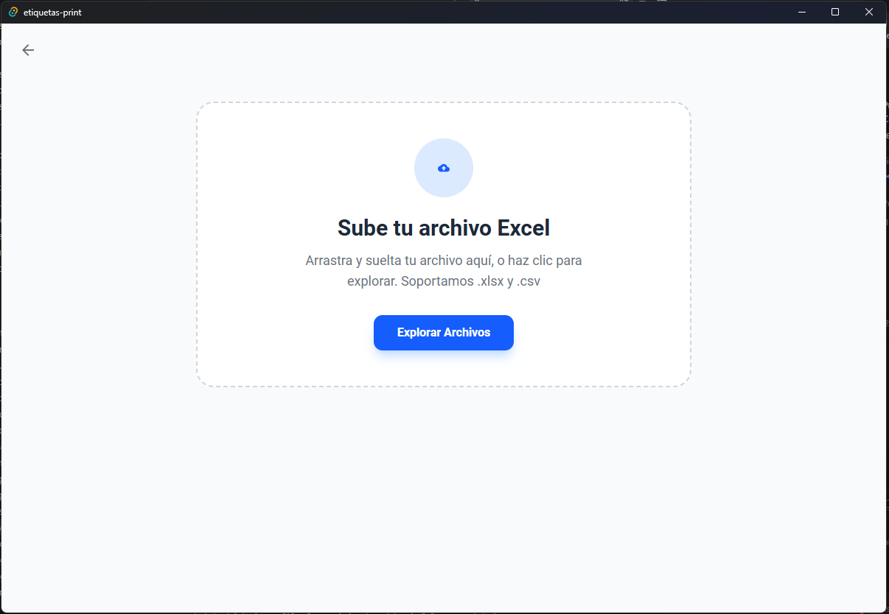
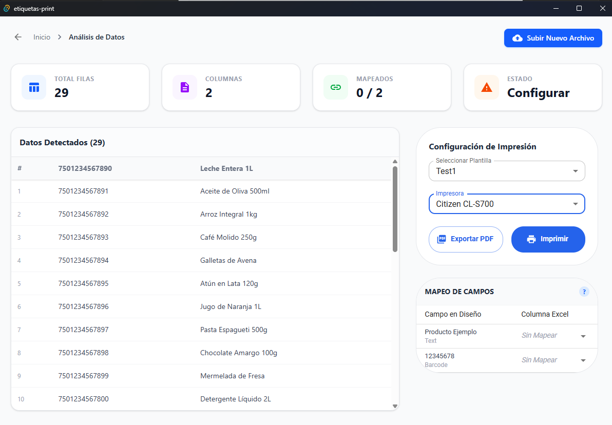
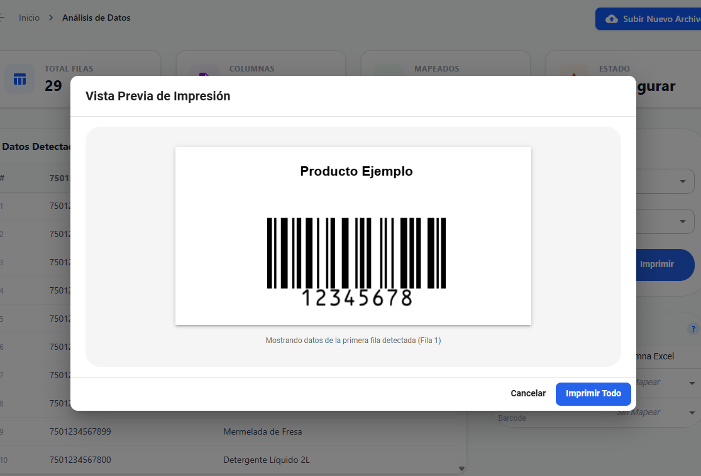

# Etiquetas Print 🖨️


**Etiquetas Print** is a powerful, modern desktop application designed for designing and printing professional labels. Built with performance and user experience in mind, it leverages the power of **Tauri**, **React**, and **TypeScript** to deliver a seamless label-editing experience.

---

## 🚀 Features

- **Advanced Label Designer**: Drag-and-drop interface for creating custom layouts using `react-konva`.
- **Barcode & QR Code Support**: Generate industry-standard barcodes (`bwip-js`) and QR codes (`qrcode`) instantly.
- **PDF Generation**: Export labels to high-quality PDF files for printing using `jspdf`.
- **Database Integration**: Manage printer configurations and templates locally with SQLite (`@tauri-apps/plugin-sql`).
- **Modern UI**: Sleek, dark-mode ready interface styled with **Tailwind CSS** and **MUI**.
- **Cross-Platform**: Runs natively on Windows (and other platforms supported by Tauri).

## 📸 Screenshots

| Dashboard                                  | Designer                                     |
| ------------------------------------------ | -------------------------------------------- |
|   |  |
|      |       |
|  |

## 🛠️ Tech Stack

- **Core**: [Tauri v2](https://tauri.app/), [Rust](https://www.rust-lang.org/)
- **Frontend**: [React 19](https://react.dev/), [TypeScript](https://www.typescriptlang.org/)
- **Styling**: [Tailwind CSS v4](https://tailwindcss.com/), [MUI](https://mui.com/)
- **Graphics**: [Konva](https://konvajs.org/)

## 📦 Getting Started

### Prerequisites

Ensure you have the following installed:

- **Node.js** (v18 or later)
- **Rust** (Install from [rustup.rs](https://rustup.rs/))
- **Build Tools** (Visual Studio C++ Build Tools on Windows)

### Installation

1.  **Clone the repository**

    ```bash
    git clone https://github.com/jjarroyo/etiquetas-print.git
    cd etiquetas-print
    ```

2.  **Install dependencies**

    ```bash
    npm install
    ```

3.  **Run in Development Mode**
    This will start the frontend server and the Tauri window.
    ```bash
    npm run tauri dev
    ```

### Building for Production

To create an optimized executable installer:

```bash
npm run tauri build
```

The executable will be located in `src-tauri/target/release/bundle/nsis/`.

## 🤝 Contributing

Contributions are welcome! Please fork the repository and submit a pull request for any improvements or bug fixes.

---

Developed by **[Your Name/Team]**
